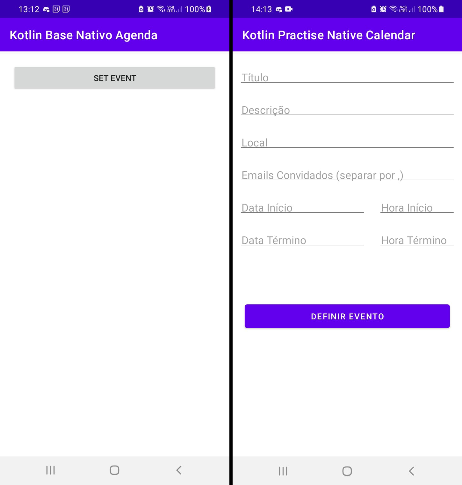

# Kotlin Practise Native Calendar

- Instrutor: Daniel Richter
- Plataforma de Ensino: https://digitalinnovation.one/sign-up?ref=K5EF2VCVKA
- Módulo Utilizando Recursos Nativos do Android (Agenda)

	

## Vídeo Explicativo

  [Youtube](https://youtu.be/02Gxn7O8N4o)

##  Objetivo

- Aplicação destinada à prática do módulo Utilizando Recursos Nativos do Android (Agenda).

## Tecnologias Utilizadas

- Kotlin
- TypeScript
- viewBinding
- Intent
- CalendarContract Events
- CalendarContract Attendees
- CalendarContract Reminders

## Conteúdo apresentado

- Conceitos Básicos
- Permissões
- Inserindo um evento na agenda

## Desafio proposto

- Inserir participantes no evento (ok)
- Inserir Reminders no evento (to do)

## Autor

- Bruno Gamba Rocha
- https://www.linkedin.com/in/bruno-gamba-rocha/